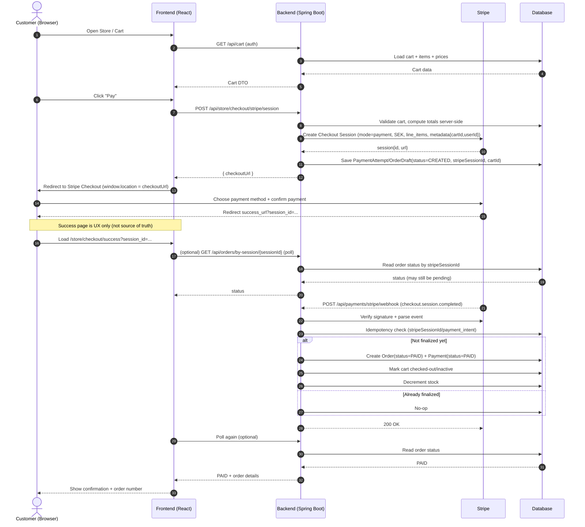

# Stripe Checkout + Webhook Payment Flow

## Overview
This flow handles card payments using Stripe Checkout while keeping the backend webhook as the **only source of truth** for payment completion and order finalization. The frontend only initiates Checkout and presents UX feedback. The backend computes totals, creates the Checkout Session, and finalizes orders **only after** receiving a verified Stripe webhook event.

**Why not create final orders before webhook confirmation?** A successful redirect or a client-side “Pay” action does not guarantee funds were captured. Webhooks are the authoritative signal from Stripe, and they can arrive after redirects or be retried. Finalizing only on webhook prevents false positives, double-fulfillment, and revenue leakage.

## Key principles / rules
- Webhook events are the **source of truth** for payment status.
- Server computes totals; the frontend never provides authoritative prices.
- Orders are finalized **only** on verified, idempotent webhook processing.
- Frontend success page is **UX only**, not confirmation.
- All requests use authentication/authorization where required.

## Sequence diagram

## Frontend responsibilities
**Must do**
- Request a Checkout Session from the backend (`POST /api/store/checkout/stripe/session`).
- Redirect the browser to the returned `checkoutUrl`.
- Treat the success page as **informational** only; optionally poll the backend for status.
- Handle “pending” states gracefully (payment may be processing).

**Must not do**
- Do **not** compute or trust totals in the client.
- Do **not** finalize or create orders.
- Do **not** treat the redirect to success URL as payment confirmation.

## Backend responsibilities
**Must do**
- Validate cart and compute totals server-side.
- Create Stripe Checkout Sessions with metadata (cartId, userId).
- Persist a PaymentAttempt/OrderDraft before redirecting.
- Verify webhook signatures and parse events.
- Finalize orders **only** on verified webhook events.
- Enforce idempotency using Stripe session/payment intent identifiers.

**Must not do**
- Do **not** finalize orders on session creation.
- Do **not** accept client-provided totals or product prices.
- Do **not** store or log secrets in plaintext.

## Stripe configuration checklist
- **Publishable key**: Used only in the frontend when needed (e.g., Stripe.js). Never on the server.
- **Secret key**: Used only on the backend to create sessions and call Stripe APIs.
- **Webhook secret**: Used only on the backend to verify Stripe signatures.
- **Required events** (at minimum):
  - `checkout.session.completed`
  - (Optional but recommended) `payment_intent.payment_failed`, `checkout.session.expired`
- **Webhook endpoint**: Use a placeholder path such as `/api/payments/stripe/webhook` (avoid public production URLs in documentation).

## Idempotency + failure modes
- **Duplicate webhooks**: Stripe retries; backend must be idempotent by `stripeSessionId` or `payment_intent`.
- **Delays/out-of-order events**: Webhooks can arrive after frontend redirects; UI must allow pending states.
- **Expired/canceled sessions**: Update PaymentAttempt/OrderDraft to a terminal non-paid state.
- **Retries and network failures**: Return non-2xx only when necessary; rely on idempotency to safely reprocess.

## Security note
- **No secrets in this wiki**. Do not include real keys, tokens, or environment values.
- Use placeholders for endpoints and configuration values.
- Treat webhook secrets and secret keys as server-only values.

## Testing / verification
- Use Stripe CLI to forward events to your local webhook endpoint:
  - `stripe listen --forward-to http://localhost:8080/api/payments/stripe/webhook`
- Success criteria:
  - Checkout session created successfully from backend.
  - Webhook event is verified and processed once.
  - Order status becomes `PAID` only after webhook.
  - UI shows confirmation only after backend reports `PAID`.

## Troubleshooting
- **Success page shows, but order stays pending**: Webhook not received, not verified, or not processed (check signature verification and Stripe CLI forwarding).
- **Orders created twice**: Idempotency missing or keyed incorrectly.
- **Incorrect totals or pricing**: Backend not computing totals or using client-provided values.
- **No webhook events**: Webhook endpoint URL incorrect, firewall/network issues, or Stripe CLI not running.

## Common anti-patterns
- Creating orders immediately on “Pay” click.
- Trusting frontend-provided totals or line items.
- Treating the success URL redirect as payment confirmation.
- Skipping signature verification for webhook events.
